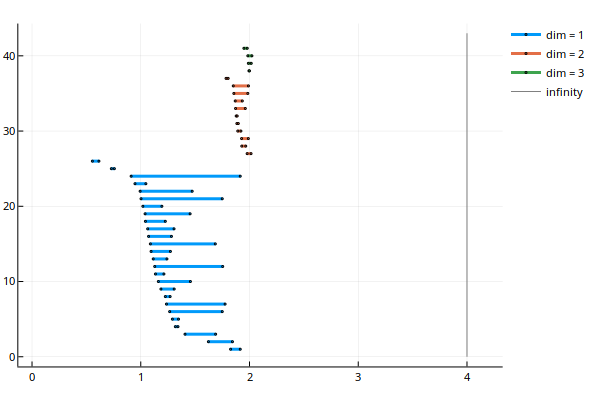
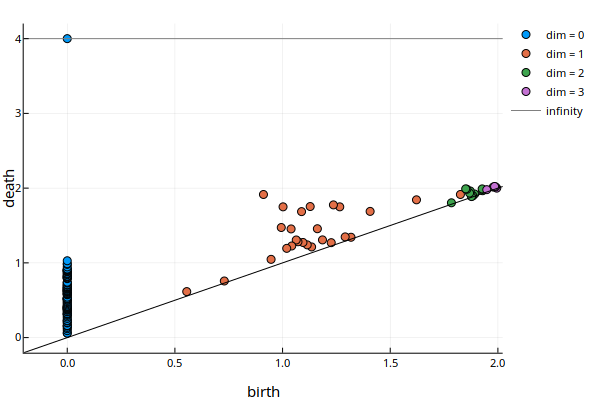

# PersistenceBarcodes

[](https://travis-ci.org/mtsch/PersistenceBarcodes.jl)
[](https://ci.appveyor.com/project/mtsch/persistencebarcodes-jl)
[](https://coveralls.io/github/mtsch/PersistenceBarcodes.jl?branch=master)
[](http://codecov.io/github/mtsch/PersistenceBarcodes.jl?branch=master)


Simple persistence barcode package for Julia. Currently only used for pretty
printing and plotting.

## Installation

To install this package, run:

```
Pkg.clone("https://github.com/mtsch/PersistenceBarcodes.jl")
Pkg.build("https://github.com/mtsch/PersistenceBarcodes.jl")
```

## Usage

### `PersistencePair`

A persistence pair stores the birth and death of a generator and optionally some
data. The data can be used to store any additional information, for example the
simplex that killed the generator.

#### Constructor:

* `PersistencePair(birth, death, data::U = nothing)`

#### Operations:

* `birth(pair)`: Get the birth time of the pair.
* `death(pair)`: Get the death time of the pair.
* `data(pair)`: Get the data associated with the pair.
* `b, d = pair`: This works like with tuples.

### `PersistenceBarcode`

A `PersistenceBarcode` is a wrapper for an array of arrays of
`PersistencePair`s.

#### Constructors:

* `PersistenceBarcode(arr::AbstractVector)`
* `PersistenceBarcode(arrs::Vararg)`

#### Operations:

* `dim(barcode)`: Get the dimension of the barcode (= `length(barcode) - 1`).
* `barcode[d]`: Get the `d`-th dimension subdiagram (this indexing is
  zero-based). You can also iterate over a barcode.
* `map(f, barcode)`: Like the `map` function in Base. `f` must return a
  `PersistencePair`, since the result is a `PersistenceBarcode`.
* `filter(f, barcode)`: Like the `filter` function in Base.
* `plot(barcode[, dims = 0:dim(barcode)])`: Plot the barcode. Only plot the dims
  selected by the `dims` keyword argument. Requires
  [Plots.jl](https://github.com/JuliaPlots/Plots.jl).
* `persistencediagram(barcode[, dims = 0:dim(barcode)])`: Plot as a persistence
  diagram. Only plot the dims selected by the `dims` keyword argument. Requires
  [Plots.jl](https://github.com/JuliaPlots/Plots.jl).

#### Example plots:




## TODO

* Implement bottleneck and Wasserstein metrics.
